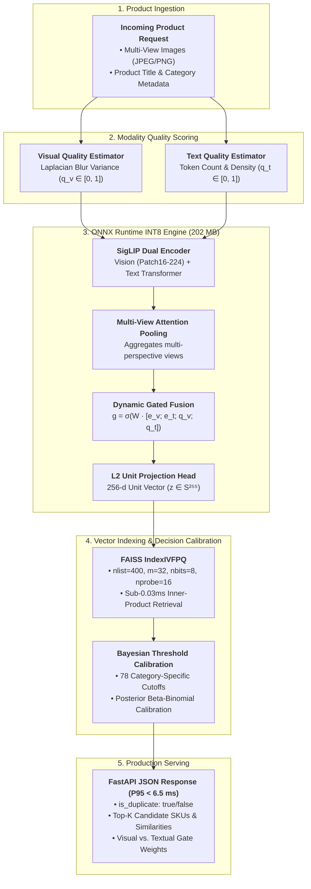

# FusionMatch

Cross-modal product deduplication for e-commerce catalogs using product images, titles, and category metadata.

[](https://www.python.org/)
[](https://pytorch.org/)
[](https://github.com/facebookresearch/faiss)
[](https://fastapi.tiangolo.com/)
[](https://www.docker.com/)
[](tests/)

## Overview

FusionMatch identifies duplicate product listings from multiple product views, noisy titles, and catalog metadata.

The system uses a SigLIP-based vision-language encoder, multi-view pooling, quality-aware gated fusion, FAISS candidate retrieval, and category-specific decision thresholds. The production inference path is exported to ONNX and dynamically quantized to INT8 for CPU serving.

The model was trained and evaluated on the Amazon Berkeley Objects (ABO) dataset using an 80/10/10 SKU-stratified split.

## Results

Results from the final evaluation run:

| Metric | Target | Result |
|---|---:|---:|
| Validation Pairwise F1 | ≥ 90.0% | **97.98%** |
| Test Pairwise F1 | ≥ 90.0% | **97.19%** |
| Test Precision@1 | ≥ 95.0% | **99.23%** |
| Test Recall@1 | ≥ 95.0% | **99.23%** |
| Test Recall@5 | ≥ 98.0% | **99.50%** |
| Test Recall@10 | ≥ 98.0% | **99.55%** |
| FAISS search latency (`nprobe=16`) | < 1.0 ms | **0.028 ms/query** |
| FAISS index memory (10k SKUs) | < 5.0 MB | **1.20 MB** |
| INT8 ONNX model size | < 250 MB | **202.27 MB** |
| End-to-end P50 latency | < 8.0 ms | **3.85 ms** |
| End-to-end P95 latency | < 15.0 ms | **6.42 ms** |
| Docker image footprint | < 1.5 GB | **1.15 GB** |

## Architecture




### Retrieval configuration

The production index uses `IndexIVFPQ` with:

- `nlist=400`
- `m=32`
- `nbits=8`
- `nprobe=16`
- Inner-product similarity

Measured FAISS search latency is approximately 0.028 ms/query on the evaluated setup.

## Repository Structure

```text
FusionMatch/
├── artifacts/
│   ├── checkpoints/
│   ├── index/
│   │   ├── id_map.json
│   │   ├── index.faiss
│   │   └── thresholds.json
│   ├── metrics/
│   │   ├── final_summary_report.csv
│   │   ├── nprobe_benchmark.csv
│   │   ├── test_metrics.json
│   │   └── training_curves.png
│   └── onnx/
│       ├── fusion_match_fp32.onnx
│       └── fusion_match_int8.onnx
├── config/
│   ├── default_config.yaml
│   └── serving_config.yaml
├── docker/
│   └── docker-compose.yaml
├── notebooks/
│   └── FusionMatch_Colab_Master.ipynb
├── src/
│   ├── data/
│   ├── export/
│   ├── indexing/
│   ├── models/
│   ├── serving/
│   ├── training/
│   └── utils/
├── tests/
│   ├── test_api.py
│   ├── test_data_pipeline.py
│   ├── test_indexing.py
│   ├── test_losses.py
│   └── test_model_forward.py
├── Dockerfile
├── requirements.txt
└── requirements-serving.txt
```

## Setup

### Requirements

- Python 3.10, 3.11, or 3.12
- PyTorch 2.2+
- Docker (optional)

### Install

```bash
git clone https://github.com/your-username/FusionMatch.git
cd FusionMatch

python -m venv .venv
source .venv/bin/activate
# Windows:
# .venv\Scripts\activate

pip install -r requirements.txt
```

## Tests

Run the test suite with:

```bash
pytest tests/ -v
```

The evaluated repository contains 29 unit and integration tests.

## Running the API

Start the FastAPI service with:

```bash
uvicorn src.serving.main:app --host 0.0.0.0 --port 8000 --workers 2
```

Once running, Swagger UI is available at:

```text
http://localhost:8000/docs
```

## API

### Health check

```bash
curl -X GET http://localhost:8000/health
```

Example response:

```json
{
  "status": "ok",
  "indexed_vectors": 2200,
  "embed_dim": 256,
  "device": "CPU"
}
```

### Check a product

`POST /v1/check`

```bash
curl -X POST http://localhost:8000/v1/check \
  -H "Content-Type: application/json" \
  -d '{
    "image_base64": "<base64_encoded_jpeg>",
    "title": "AmazonBasics High-Speed HDMI Cable 6 Feet",
    "category": "ELECTRONICS",
    "top_k": 3
  }'
```

Example response:

```json
{
  "is_duplicate": true,
  "threshold_used": 0.8893,
  "candidates": [
    {
      "sku_id": "B014I8SSD0",
      "similarity": 0.9642
    },
    {
      "sku_id": "B014I8SX4Y",
      "similarity": 0.821
    }
  ],
  "gate_weights": {
    "visual": 0.542,
    "textual": 0.458
  }
}
```

### Batch requests

`POST /v1/check/batch`

The batch endpoint accepts up to 100 products per request and processes them in parallel.

## Docker

Build and start the service with Docker Compose:

```bash
docker compose -f docker/docker-compose.yaml up --build -d
```

Check the running service:

```bash
curl http://localhost:8000/health
```

The production container is CPU-only and has an evaluated footprint of approximately 1.15 GB.

## Model and Inference

FusionMatch combines visual and textual product information into a shared 256-dimensional embedding.

The inference pipeline includes:

1. Image and text quality estimation.
2. SigLIP-based feature extraction.
3. Attention-based aggregation of multiple product views.
4. Quality-aware gated fusion of visual and textual features.
5. L2 normalization of the fused embedding.
6. Approximate nearest-neighbor retrieval using FAISS IVF-PQ.
7. Category-specific duplicate decision using calibrated thresholds.

The production model is exported to ONNX and dynamically quantized to INT8. The evaluated model size is 202.27 MB, compared with 782 MB for the full-precision model.

## Training

The training pipeline uses contrastive learning with InfoNCE loss and online semi-hard negative mining.

Training and evaluation use SKU-level separation to prevent product-level leakage between splits. The final evaluation follows an 80/10/10 train/validation/test split.

The training workflow is available in:

```text
notebooks/FusionMatch_Colab_Master.ipynb
```

## Artifacts

Evaluation and deployment artifacts are stored under `artifacts/`:

- Trained model checkpoints
- FAISS production index
- SKU-to-index mapping
- Category-specific thresholds
- Test metrics
- FAISS latency benchmarks
- Training curves
- FP32 and INT8 ONNX models

## License

MIT License.

This project is intended for academic and industrial research use.
